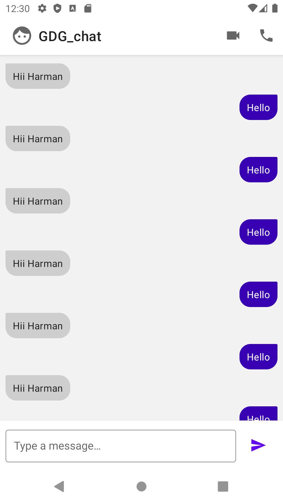

WindowInsetsAnimation sample
============

This sample shows how to react to the on-screen keyboard (IME) changing visibility, and also controlling the IME's visibility. To do this, the sample uses the new [WindowInsetsAnimation](https://developer.android.com/reference/android/view/WindowInsetsAnimation) and [WindowInsetsAnimationController](https://developer.android.com/reference/android/view/WindowInsetsAnimationController) APIs in [Android 11](https://developer.android.com/11).

## Features

The app displays a fake instant-message style conversation, and has two key pieces of functionality:
